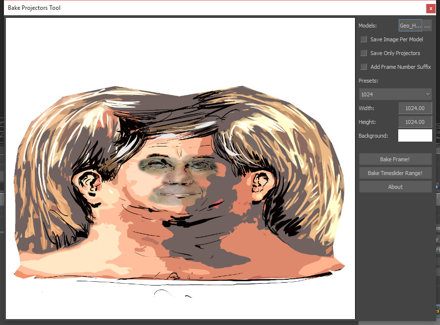

[Back To Main Page](README.md)

[Back To Plugins Page](Plugins.md)

# Bake Projectors Tool

 With a help of the tool you can convert projected textures back to uv-space texture. Bake tool uses the same render algorithm as the original projected texture shader, means it applies all features of multi projectors with blending modes, masking and opacity.

## Use cases

Bake Projection tool has been used in face stabilization pipeline. Read more about that in Facial page.
