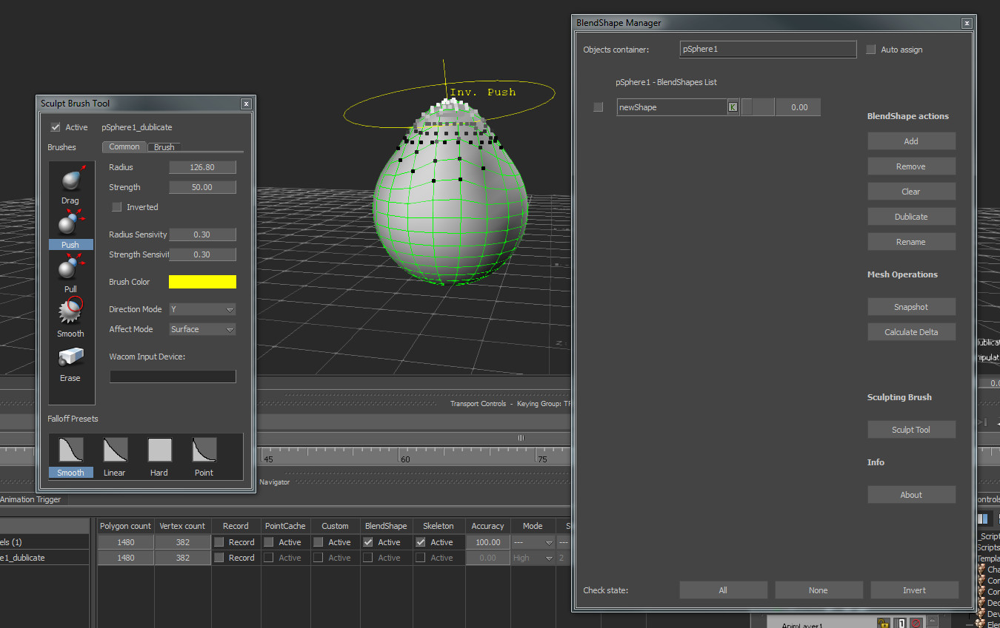

[Back To Main Page](README.md)

[Back To Plugins Page](Plugins.md)

# BlendShape Toolkit

Toolkit for adding and editing geometry blendshapes.

## Overview

**Main goal** – making corrective blendshapes for geometry objects.

Parts of the toolkit
* **Blendshape tool**
* **Sculpt manipulator**
* **Blendshape Deform constraint**

Important Limitations:
- BlendShape Tookit works only with polygons geometry models.
- to use normals blending in blendshapes you should activate it in config file1
- for sculpt brush the model should be without scale

Configuration for the plugin is located in config folder with name <PC Name>.BlendShapeToolkit.txt

**Note!** By default in blendshapes computation of normals are switched off. You can turn it on manually in .Application.txt config file with parameters ShapeBlendNormals and ShapeComputeNormals.

## BlendShape Tool

Objects container - drop objects here to have a list of their blendshapes. When the model is in container, you can apply some blendshape manipulations (like add a new one, remove, rename, dublicate, etc.)

Blendshapes operations:
* Add - select a model (prefered that the model is a snapshot) and press this button to add it as a new blendshape to the object in container. For multiple selection each object will be added as a new blendshape.
* Remove - check blendshapes with special checkboxes to remove them
* Clear - clear all blendshapes for the models in container
* Dublicate - dublicate checked blendshapes
* Rename - rename checked blendshapes

Mesh operations:
* Make snapshot – special algorithm for extracting current geometry shape from selected object (even dynamic with deformation applied).
* Calculate Delta - from the given base mesh and it’s modified snapshot, generate a new base mesh with calculated offsets of the modification. This function is a general step for making corrective blendshapes.

Sculpting:

Sculpt Tool - open a sculpt tool. If some model is already selected in the scene, it will automaticle entered sculpting.

Bottom line of buttons are for manage blendshapes checkboxes, like check all of them, inverse checkboxes or clear check states.

**Important Note about Snapshot.** When you are making a snapshot, plugin makes a stamp of properties with information about the snapshot frame and base model. This information helps to calculate delta later.

Snapshot special user properties:
* SnapshotTime - double user properties contains information about snapshot local time in double seconds.
* BaseModel - string user property, contains information about base model name

## Sculpt manipulator

Sculpt manipulator – special brush for changing geometry shape.

Modes for sculpturing:
* Drag
* Push
* Pull
* Smooth
* Erase
* Paint

Brush parameters:
* Radius
* Strength

Direction Mode:
* Screen
* Average Normal
* First Normal
* Vertex Normal
* X
* Y
* Z

Direction mode is useful mostly for Push and Pull brushes.

Affecting:
* Volume – affect all available vertices in specified radius
* Surface – affect vertices from the connected faces in specified radius

Falloffs change a way of brush weights distribution during sculpturing.

2d screen painting mode

Keyboard shortcuts:
* Hold Shift button to active Smooth brush
* Hold Ctrl button to Inverse strength value
* Use Left mouse button for sculpturing
* Use Middle mouse button for changing strength
* Use Right mouse button for changing radius

In Common tab you change values globaly, in Brush tab you have a possibility to active “Override” options and make unique radius and strength for specified brush.

In Wacom Input container you can drop a Wacom device from the scene. That gives a pressure control from a pen during sculpturing. In that device you should specify one working region.

### Painting Mode

**Important note** Paint mode works correctly only on a mesh with pre-defined color channel. Otherwise it will not store a result of painting.

Where to use vertex colors? It can be used in a lot of situations like blending mask, etc but write now in MoBu there is no interface to use it at all.

## Deformable meshes and deform constraint.

Blendshape deform constraint - this is a constraint for storing internal blendshapes inside and gives possibility to sculpt new corrective shapes. Adv. of using that constraint is speed in processing and best precise. Without using a constraint shapes, you need to calculate delta and then add it a classic blendshape.

DisAdv of that constraint is that you cannot open that modifications in any other applications. But you always can bake mesh deform animaton into the point cache data.
