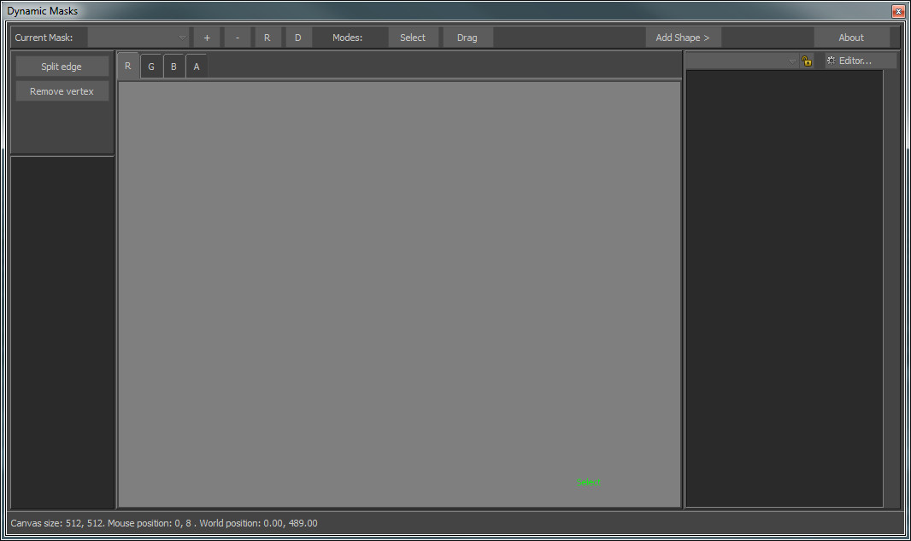
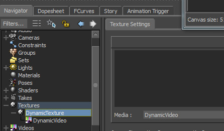

[Back To Main Page](README.md)

[Back To Plugins Page](Plugins.md)

# Dynamic Masks Tool plugin

Tool for working with dynamic textures, creating animated masks

## Hardware requirements

Dynamic Masks Tool uses nVidia "NV_path_rendering" extension.

## Overview

This tool gives your posibility to prepare some texture masks that you can use for alpha blending or masking projections for example.

Plugin supports MotionBuilder starting from version 2014.

## Dynamic Masks Tool

UI in this tool is some case simular to Composite Master Tool. We have top panel with list of avaliable maks in the scene and buttons.

Main toolbar buttons:
* “+” - add a new mask into the scene
* “-” - remove a current mask from the scene
* “R” - rename current mask
* “D” - dublicate current mask

We also have on that toolbar a modes switcher:
* Select - use this mode to select shape knots
* Drag - drag knots under cursor
* Button “Add Shape>” shows a context menu, where we have an option to add a new shape on the canvas for current mask and current channel.

To add a new shape we should select some adding mode, for example Add Shape->Add a new rectangle and then click on the canvas to place a new shape.

Above the canvas we have a tab panel with 4 channels (R, G, B, A). Use this tabs to switch between channels and make some of them current. 

On left side we have button to operate with the shape.
* Split edge - select two or more knots and this function will split edges between selected knots. It’s a good way to make shape more complex.
* Remove vertex - delete selected knots from current shape and current channel.

Each masks is a new dynamic texture. After your create it, a new texture will appear in the navigator Textures category.

Each masks has 4 channels. In texture terms it’s R, G, B, A. Means that you can individualy assign some drawing in each texture channel of the mask and then use each channel as a separate mask. In projective mapping shader each channel is assigned as a mask for the correspondant projection.

On each channel canvas you can put some objects. Right now it can be only rectangles.

### Dynamic Mask

Properties:

* Canvas Width
* Canvas Height
* Video
* Blur Factor

### Dynamic Channel (R, G, B, A)

Properties:

* Show Grid
* Blur Factor
* UV Layout
* Show Texture
* Show Wireframe

### Dynamic Shape

Properties:

* Color RGB
* Position
* Rotation
* Scale

### Dynamic Knot

Properties

* Position
* Type (Line, Curve)

## Tutorial

The most reasonable use of dynamic masks is in pair with Projective mapping shader or Composition Toolkit.
