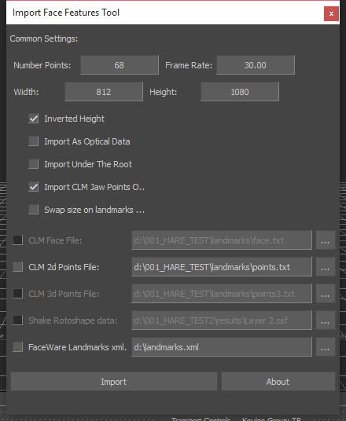

[Back To Main Page](README.md)

[Back To Plugins Page](Plugins.md)

[Back To Scripts Page](Scripts.md)

# Facial retargeting pipeline

Here they are common steps:

* Prepare source data
* Head RIG in Maya
* Setup a MoBu scene
* Retarget optical data to head joints
* Bake animation and merge with a body
* Bake projectors and stabilization (if needed)

Names for common data locations (project organization):

* FACIAL_DATA - source tracked point cloud 
* FACIAL_ANIMATION - retargeted face animation on a rig
* FACIAL_BAKED - plotted face animation on a face base skeleton and baked projected textures 

## Prepare source data

Source data for facial animation contains:
* source video and extracted image sequence with 90 degree rotation to have normal vertical face orientation
* extracted landmarks positions from Faceware Analyzer (*.xml format)
* extracted landmarks positions from [OpenFace (*.txt format)](https://github.com/TadasBaltrusaitis/OpenFace)
* extracted landmarks from Mocha

### From source data into MoBu optical clip

  In the “Import Facial Landmarks” tool we need to choose extracted landmarks from Faceware Analyzer and Cambridge Face Tracker. Tool calculates optical data markers that we could use later with retargeting constraint.

**NOTE!** Cambridge Face Tracker has a very low precision, so I’m using it only for jaw movement. In most cases even for jaw movement it’s not suits well, in that case I’m creating a rigid body connection between jaw markers and several lips markers to fill the bad movement gaps for jaw.

 Optical data could be post filtered with Peak Removal and Butterworth filters. Take care about filtering mouth inner and eyes markers to keep original countour as close as possible.

**OPTIONAL!** Also audio source need to be sync with the optical data. Later audio can be used for added secondary motion on a face.

Tutorial videos (not avaliable):

* How to prepare a vertical oriented image sequence from the source video
* How to use Cambridge Face Tracker
* How to use “Import Facial Landmarks” tool in MoBu
* How to edit and filter facial optical data

## Import Face Landmarks Tool

Tool for importing data from Faceware Analyzer and Cambridge Face Tracker. As the FaceTracker doesn’t give good quality and Analyzer doesn’t give jaw movement, I’m compose these two data source together. I’m tacking jaw positions from FaceTracker data and the rest from Analyzer. In the video I’m showing how to manage import process in that tool. In most cases I’m importing data as optical data (there is a special flag in tool for doing that). 

**NOTE!** You don’t need to change values like number of points (which is connected to FaceTracker), frame rate (also for FaceTracker) and Width\Height (which comes automaticaly from Analyzer xml header)

Tool will put custom user properties of a input data width and height.

## Head RIG in Maya

Common errors:

1) internal countour like mouth and eyes. In the image below I show a wrong joint placement. There should be no gap between joint pivot and mouth internal border, otherwise we will have this offset in facial retargeting step later.

2) As retargeting process is using backing surface which is flat, you should put joint in the same way, keep then flat on a face in Z axis. That will help to keep mouth lips deepness. On the image below I show a wrong placement. 

## Setup a MoBu scene

Rig model has groups:
* Head geometry - group that can be useful to turn off viewport head geometry picking
* Backing geometry - group that contains backing mesh which is used for facial retargeting constraint (use this group to hide/show backing mesh)
**NOTE!** Before ploting facial retargeting constraint into bones, it’s better to show backing mesh

* PLOT_JOINTS - list of joints that need to be plotted with retargeting constraint
* HARD_PLOT_JOINTS - list of joints that need to plotted USING a hardPlot script

Rig scene contains 4 cameras-projectors for mouth, nose and eyes areas. Also this scene has one dynamic mask for projectors areas.

## Retargeting optical data to head joints

NEW MOTION ON A RIG

Merge new optical clip, setup the facial retargeting constraint. Adjust cameras positions, dynamic mask areas if needed. Also can be useful to sync the audio source to apply secondary motion from it using the character face object and voice device in mobu.

## FROM RIG TO ANIMATION

Each rig has the same skeleton as a character, the same pivot points. That means, for applying rig animation to the global character, you need to merge plotted rig scene with the character model.

## EYES ANIMATION

In the scene there is a “Aim Eyes” constraint, that can be useful to control the eyes look direction. But before activating it, it’s better to bake projectors into the uv-space image sequence. 

## Parametric values in the Facial retargeting constraint

Parametric values could be useful to bind corrective blendshape.

Left\Right Eye Position show how far eyes are closed. For Left\Right Eye Low values you should specify distance when eyes are closed. For High value you should enter a value when the eyes are open. Distance is updating in real-time in the property Left\Right Eye Distance. Distance is computing between eye top marker and eye bottom marker.

## HOW TO STABILIZE FACIAL RESULT

In some cases video could have jumps and there are several steps that could help to stabilize the final look. This method is based on baking tool, so it’s a post processing method.
