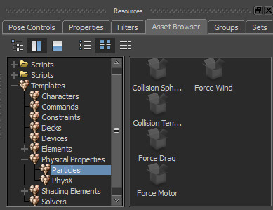

[Back To Main Page](README.md)

[Back To Plugins Page](Plugins.md)

# GPU Particles Shader

## Overview

New Elements with the plugin
* **GPU Particles shader** - main shader
* **Collision Sphere marker** - a sphere collision object for particle system
* **Collision Terrain marker** - a terrain generator and collision object
* **Force Drag** - get force from this object velocity
* **Force Wind** - specified direct force (can be turbulence)
* **Force Motor** - radial force field

Shader and objects are located in Assets Browser window.

