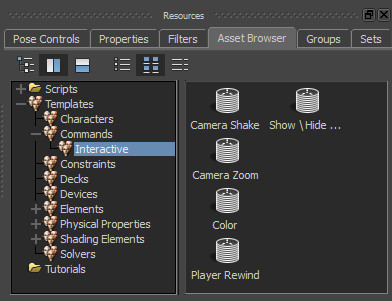
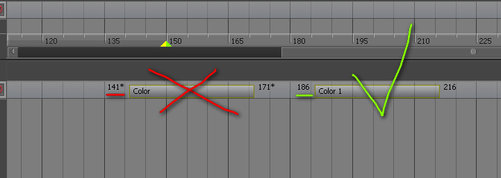
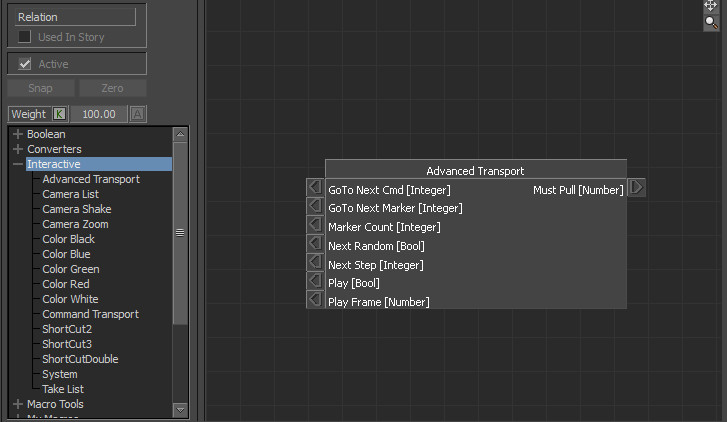

[Go To Main Page](README.md)

[Go To Plugins Page](Plugins.md)

# Interactive Pack for Autodesk MotionBuilder

    This is a collection of story commands and relation constraint boxes.

## Story Commands

    Common command properties could be changed from property view window.

### Limitations

* Razor operation applyed to any command clip in Story crashes the whole application
* Command StartFrame should be rounded to integer value, otherwise command could be skipped

### List of commands
* Color - special marker to make reference to (go to frame)
* Show/Hide Groups - command for managing groups visibility
* Rewind - command to return to the timeline beginning or to specified color marker
* Camera Shake - run a real-time shake effect for current camera
* Camera Zoom - run a real-time zoom (additive to FOV) effect for current camera

## Relation boxes

Boxes you can find in the Relation constraint under the “Interactive” category.

### Limitations

Pull output property of a node should be connected to pull number box or any animatable channel (like object translation, rotation, etc.)

### List of Boxes

* Advance transport control - control for jumping between timeline markers
* Camera List - enumerate all scene cameras and return a random index
* Camera Shake - make a 2d shake effect for a current camera (based on Optical center X,Y properties)
* Camera Zoom - makes a 2d camera zoom effect (based on changing fov parameter in real-time)
* Color Black, Blue, Green, Red, White - presets for each color command in vector form (RGB)
* Command Transport - gives possibility to jump between color commands
* Image Seq Logic(1) - store internal segments to assign for the image sequence
* Image Sequencer* - control a video clip image sequence real time parameters (start frame, stop frame, free running)
* ShortCut2 - helper box for managing combinations of 2 keys (both pressed, none pressed, etc.)
* ShortCut3 - helper box for managing combinations of 3 keys
* System - box for giving an access to change current camera, current take from specified one or from input index (from camera list, take list boxes)
* Take List - enumerate all scene takes and return some next index or random index

(1) This nodes could not be included in the interactive pack.
