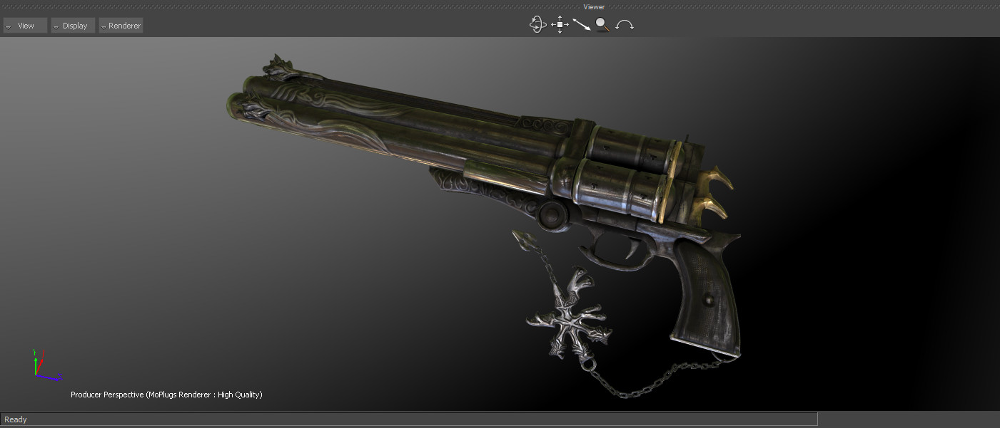

[Back To Main Page](README.md)

[Back To Plugins Page](Plugins.md)

[Back To Scripts Page](Scripts.md)

# MoRenderer Plugin for Autodesk MotionBuilder



## Resolution presets

Presets is a xml file located in the <Plugins>\System\ folder

Name of a file is “resolutionPresets.xml”

Here is an example of a file
```
<?xml version="1.0"?>
<Presets Default="2K (2.35:1)">
    <preset Name="Custom" Width="0" Height="0"/>
    <preset Name="720p (16:9)" Width="1280" Height="720"/>
    <preset Name="720p (2.35:1)" Width="1280" Height="545"/>
    <preset Name="1080p (16:9)" Width="1920" Height="1080"/>
    <preset Name="1080p (2.35:1)" Width="1920" Height="817"/>
    <preset Name="2K (16:9)" Width="2048" Height="1152"/>
    <preset Name="2K (2.35:1)" Width="2048" Height="871"/>
    <preset Name="4K HD (2.35:1)" Width="3840" Height="1634"/>
    <preset Name="4K (2.35:1)" Width="4096" Height="1679"/>
</Presets>
```
You could specify Default name, so that resolution will be used as a default.

Resolution presets are available in the Renderer object Navigator Layout or in property view.


**NOTE!**

  When using global resolution, the manager will skip all cameras that are connected to constraints (facial), shaders (projectors), user objects (extended camera and cubemap rendering)

In a future updates, better for all the facial, projectors and extended rendering use another type of object. Camera should be only for final film compositing and rendering.
