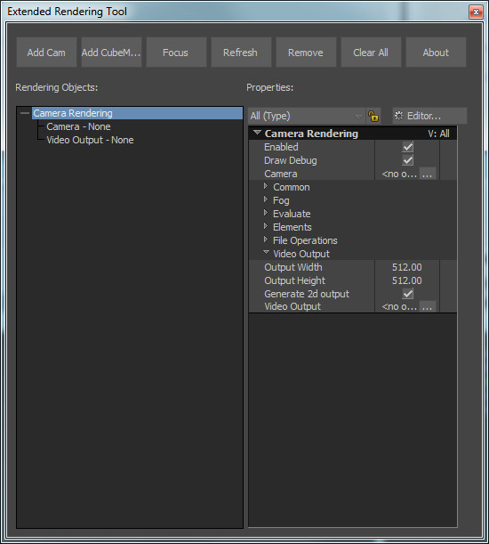

[Back To Main Page](README.md)

[Back To Scripts Page](Scripts.md)

# Offscreen Rendering Tool

This is a tool that makes it easier to work with a CameraRendering and CubeMapRendering user objects from the mo_graphics module.

This tool is a python script.

Drag And Drop support.

You can drop a camera object to the UI tree component. And from the tree component you can drag camera, texture, video component to the scene. When you dragging rendering element from the tree, then internally it will choose a texture object if some is attached.

Use Focus button to show and focus element in navigator window.
