[Back To Main Page](README.md)

[Back To Plugins Page](Plugins.md)

# Render layers plugin for Autodesk MotionBuilder

Tools that helps to manage layer of objects with assigned shaders, materials and textures. Similar to Maya display layers.

## Overview

What is this tool for ?
- if you want to put objects in layers and render them separately with masking (for future compositing in 2d)
- if you want to render objects with different materials and shaders assignment
- If you want to make a render queue with different cameras
- If you want to run a python script before or after each pass
- If you want to render for a bigger image size (like 2k or 4k images)

This plugin is for able to do all these tasks. Just simply use it instead of classic MotionBuilder “Render” operation.

What is render layer ?

Layer is a one rendering pass with specified unique or inherit options. For example, we make one layer to render an animation with all scene objects. And make another layer which inherit all options instead of camera, means we would like to render all these objects from different view. By pressing button “Render movie!” in the Render Layer Tool we will run two rendering operations with these specified options going one after another and finally it gives us two output sequences from different cameras. There is also possible to render in some layer only part of objects or render with different materials and shaders.

One more important thing about layer. It has it’s own layer state of objects, materials and shaders. Means that we can change materials in some layers and store that state of different. Then each time we swith to that layer, tool will automaticaly apply that differense. It works very simular for Maya display layers.

## Reference

### Main tool

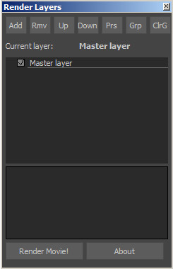()

#### User interface
* Add - add a new layer
* Rmv - remove a selected layer
* Up - move up a selected layer
* Down - move down a selected layer
* Prs - show a properties window for a selected layer
* Grp - attach selected group in scene to a selected layer
* ClrG - remove any group assignment for a selected layer
* Render Movie! - render layers job
* About - show information about author

#### Notes
1) double click on layer with pop a rename message box.
2) Master layer - main layer. It’s not possible to remove it. All other layers by default inherite all properties from the master layer.
3) check box flag in the left of a layer name switches the visibility state of a layer.

### Options panel

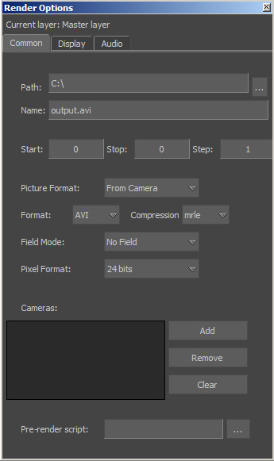()

There are 3 tabs of options - common, display и audio.

#### Notes
1) It doesn’t matter what extension was in file name, it will be replaced by the Format parameter.
2) Compression list is only for the AVI format.
3) To add a new camera to a layer, you should select a camera in a scene and press Add button.
4) Button Clear will clear all cameras list
5) If a cameras list is empty, it means that the current scene camera will be used.

For each layer you can attach a group of objects or hold a scene state.

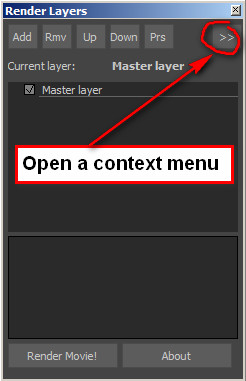()

#### Group
If group is assigned then this group of objects will be only visible during the rendering process
To assign group you should
1) select group in scene
2) select layer
3) run “assign group” command from the render layers context menu.

#### State
- models: store information about model in scene and it’s materials and shaders assignment
- materials: store information about each texture assigned to material channel

Manipulate with state from the context render layers menu.
* Store for the current layer - takes current scene information and update a state holder for the selected layer
* Clear state - remove state information from the selected layer
* Show state information - show a popup dialog box with the list of objects and properties which are in state memory

When you switch between layers, you switch between states also. It means each time you choose a new layer, the state of this layer will be assigned.

## Tutorial

Let’s start from scratch with a new MoBu scene and make several steps to setup a scene objects and two render layers.

1. Put 3 objects into the scene. Let it be cube, conus and torus.
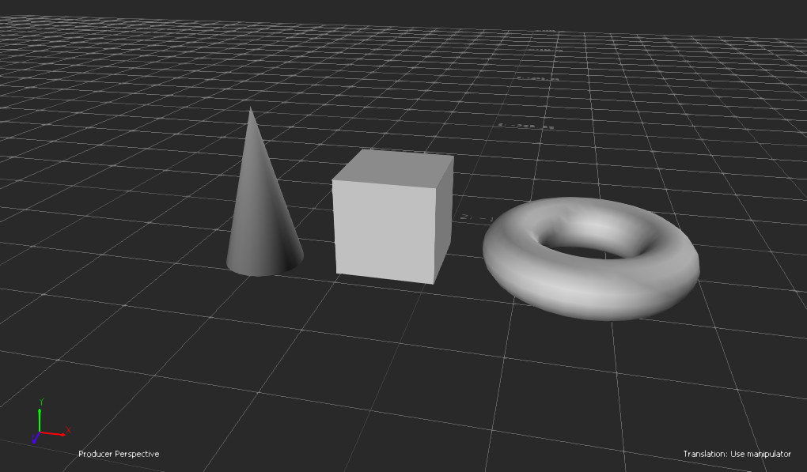

2. Lets assign 3 different materials with different colors corresponding to our 3 new shapes
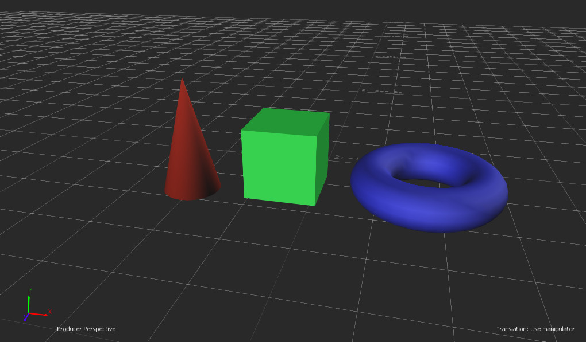

3. Lets open Render Layer Tool window. You can find it in the MoPlugs main menu or in OpenReality->Tools menu.

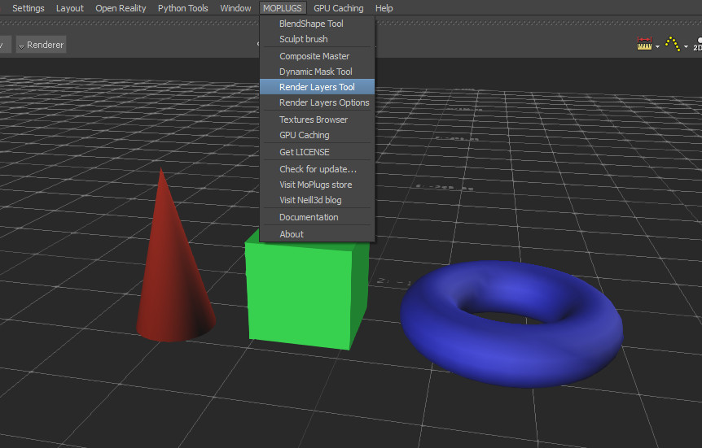

4. By default in render layers we have one Master Layer which is undeletable. This layer store in himself options to render a scene. You can enter this options by selecting a Master Layer in the listbox and press button “Prs” on top. You can specify there a path for rendering and make a test movie by pressing “Render Movie!” button in the Render Layers Tool window.

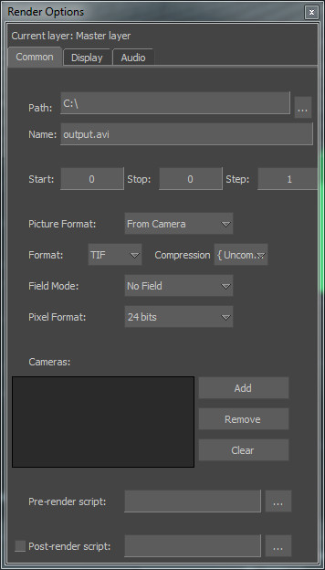

4. But our next step will be to learn more about layer state assignment. It’s very interesting possibility to store scene objects and assignment materials in layer. Then you can return back to that layout by activating that layer in layers listbox. So lets store scene state by pressing button “>>” and choosing “Store Layer State” item in the context menu.

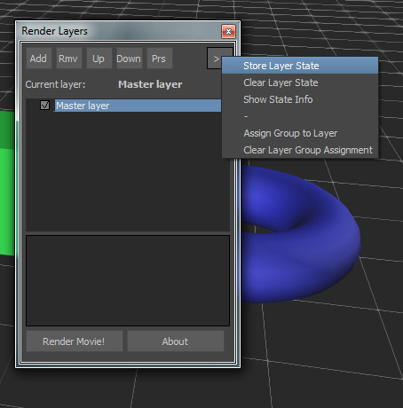

5. We always can check what is holding in our layer state by choosing item “Show State Info” in the context menu. In our example case master layer should store 4 materials and 3 objects with correspondent materials assignment.

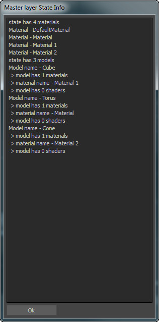

6. Now let’s make a new layer, by pressing button “Add” in the Render Layers Tool window. Lets enter “WHITE_BOX” as the name of this new layer. Note that you always have a possibility to rename layers by double click on them in the listbox.

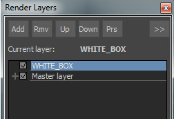

7. Lets assign a new material for all our 3 objects in the scene and make it white. Then lets store layer information for our “WHITE_BOX” layer. Now we can simply switch between layers to change state of our scene (assignment materials to objects).

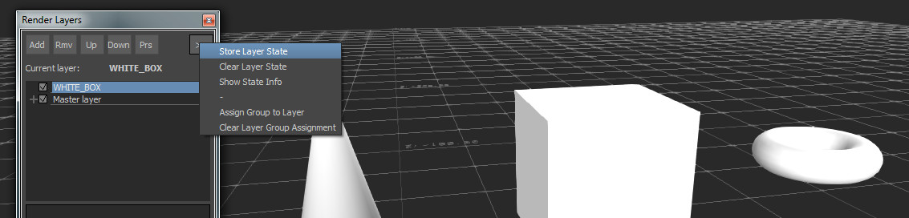

8. To render our “WHITE_BOX” layer to an another filename, we need to open first of all layer properties, by selecting layer and pressing “Prs” button. Then put a flag in front of option “Name” to override it parameter from Master Layer. And enter some file name.

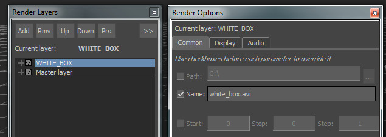

So we setup two layers with unique scene state assignment and we can press “Render Movie!” button to render two movies. Tool will automaticaly switch between states for each movie.

## Log

21.04.2013 - added a layer state. Now you can hold information about materials, shaders and textures in each layer.

12.04.2013 - 
- installation package
- fixed group loading/saving
- fixed file new to clear render layers
- fixed cameras loading/saving
- put TIF format as a default

26.03.2013 - added a feature to matte all objects outside a layer group. It close to contribution maps in Maya.

25.03.2013 - first beta version for the MotionBuilder 2013 (64 bits)
