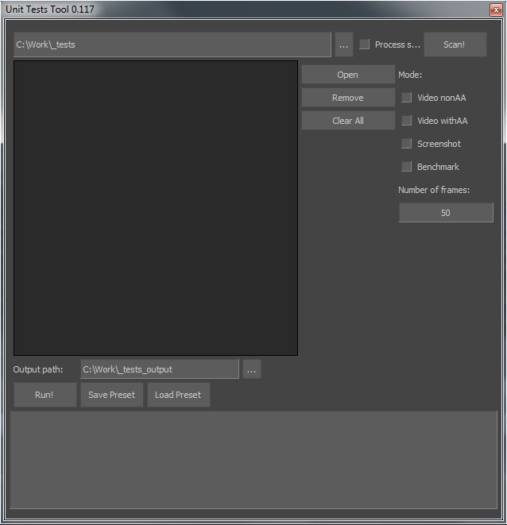

[Back To Main Page](README.md)

[Back To Scripts Page](Scripts.md)

# Unit Tests Tool

Python script - Startup / UnitTestsTool.py

Tool for running scene by scene testing with options:

*	Video nonAA - render tested scene without Antialiasing flag
*	Video withAA - render tested scene with an antialiasing flag
*	Screenshot - create a screenshot of each tested scene
*	Benchmark - run through a timeline and write down to log file information about average fps, evaluation time, etc.

Main idea of the tool is to run a batch of test scenes after utilizing a new feature. 
That could help to compare a visual and stats result of each scene with a previous running test session to be sure that everything still works correctly.
