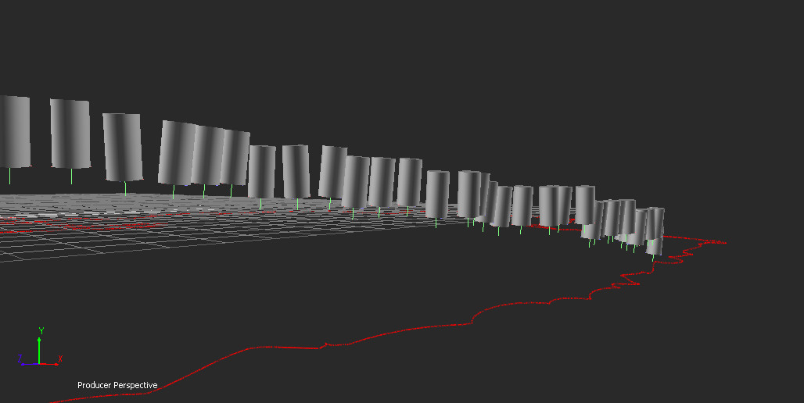

[Back To Main Page](README.md)

[Back To Plugins Page](Plugins.md)

[Back To Scripts Page](Scripts.md)

# Wall Bricks Toolkit

Contains:
- Wall bricks constraint
- Wall bricks Temp constraint
- Path Wrap constraint
- Path Test constraint

StartUp scripts 
- logic library - libDuplicateAlongACurve.py
	
Action scripts:
 - DuplicateAlongACurve_DeformMesh
 - DuplicateAlongACurve_HardPlot
 - DuplicateAlongACurve_RotateBy90
 - DuplicateAlongACurve_SelectModels
 - DuplicateAlongACurve_SelectNulls
 - **DuplicateAlongACurve_SETUP**

## DuplicateAlongACurve_SETUP

 Script for doing snapshots along a curve and setup a Wall bricks constraint

Object should be aligned to the +Z axis. Length of the node will be computed from the bounding box Z length (max - min)

Final number of shapshot elements - curve length / element Z length

There is a possibility to create instances (share the same geometry) and copies.

## Wall Bricks Constraint

 Better to create a constraint from the **DuplicateAlongACurve_Setup** script.

Maximum number of nodes in the constraint - 16384

### Expression special variables

* f - animation factor (lifetime [0;1])
* distToCamera - distance to current camera in units
* n - element index in the expression
* nN - normalized element in index (index / total count) [0; 1]
* rF - normalized random value for that element. generated on each expression evaluation.

### Expression special function

* select (value, a, b) - make a newValue [0; 1] which interpolates between a and b.

### Expression examples

for y scaling
1) f
2) var x:=clamp(0.0, 0.5+1.0-distToCamera/900, 1.0); f*x*x
