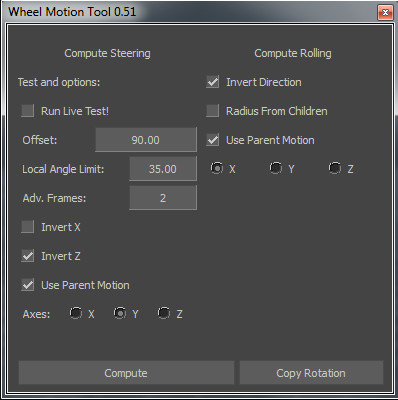

[Back To Main Page](README.md)
[Back To Scripts Page](Scripts.md)

Python tool for computing wheel roll and steer angles according to itself motion trajectory or parent motion trajectory. With a tool there is also a helper file - **SteeringConstraint.fbx** that contains relation constraint for entering tool Live mode.

 In Live mode some parameters you could change in run-time 
* Offset
* InvertX
* InvertZ

If Parameter Local Angle Limit is zero, then it will not be used in computation. The parameter limits the steering angle for a wheel.

 The Script rolling computation uses wheel geometry radius and motion trajectory distance to calculate number of roll cycles.
If your animatable wheel node is Null and it doesn't contain any geometry, then to determine wheel size and wheel roll cycles you should put a checkbox "Radius From Children". That also means that real wheel geometry should be parented to a control Null node.
 You can use Copy Rotation to duplicated computed rotation keys from one wheel to another. Helpful when you have different axis orientation on wheels. You should select two models: first source wheel and then destination wheel. After just press a button.

### Log ###

* 28.03.2015
    * First utility build
